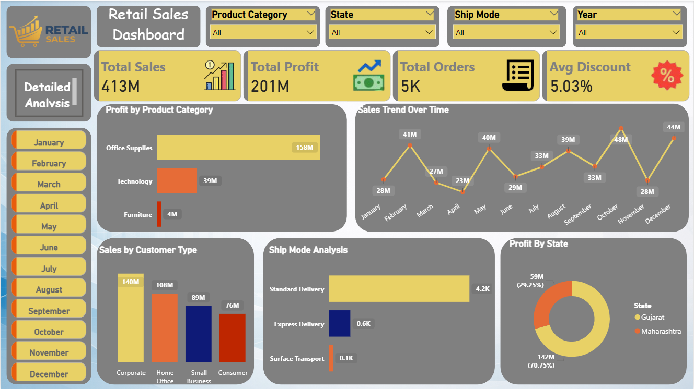

# Retail Sales Dashboard | SQL + Power BI

## Project Overview

This project analyzes retail sales data using SQL and Power BI to build an interactive business intelligence dashboard.

The dashboard provides meaningful insights into:

- Total Sales, Total Profit, and Total Orders
- Sales Trend Over Time (Monthly Performance)
- Profit by Product Category
- Sales by Customer Type
- Shipping Mode Analysis
- Profit by State
- Discount Impact on Profitability

The goal of the project is to transform raw sales data into clear, actionable insights for business decision-making.

---

## Objective

- Understand overall business performance through key KPIs
- Identify the most profitable product categories
- Analyze customer segments and buying behavior
- Evaluate the impact of discounts on profit
- Compare shipping modes and delivery patterns
- Provide insights that support data-driven decisions

---

## Dataset

- **Total Records:** 4,925 orders

**Attributes Include:**  
Order Date, Customer Name, City, State, Customer Type,  
Product Name, Product Category, Order Quantity,  
Sub Total, Discount %, Discount, Order Total,  
Shipping Cost, Delivery Days, Total, Total Profit Per Order

---

## Data Cleaning (Excel Phase)

Before analysis, the dataset was cleaned using Microsoft Excel:

- Checked for missing values
- Corrected data formatting
- Ensured numeric columns were valid
- Verified calculation fields
- Removed inconsistent or incomplete records

This step ensured accuracy and reliability for SQL analysis and dashboard creation.

---

## SQL Integration (Analysis Proof for Interviews)

The cleaned CSV file was imported into SQL under the table:

**Table Name:** `retail_sales`

### Key SQL Queries Used

## 1️⃣ Total Sales

```sql
SELECT SUM([Total Profit Per Order]) AS total_profit
FROM retail_sales;
```


## 2️⃣ Total Profit

```sql
SELECT SUM([Total Profit Per Order]) AS total_profit
FROM retail_sales;
```


## 3️⃣ Profit by Product Category

```sql
SELECT [Product Category],
       SUM([Total Profit Per Order]) AS profit
FROM retail_sales
GROUP BY [Product Category];

```

## 4️⃣ Profit by State
```sql
SELECT State,
       SUM([Total Profit Per Order]) AS profit
FROM retail_sales
GROUP BY State;
```


## 5️⃣ Discount Impact on Profitability
```sql
SELECT [Discount %],
       AVG([Total Profit Per Order]) AS avg_profit
FROM retail_sales
GROUP BY [Discount %];

```


## Power BI Dashboard Features

### Overview Page

The main dashboard presents high-level business insights:

- KPI Cards (Total Sales, Total Profit, Total Orders, Avg Discount)
- Sales Trend Over Time
- Profit by Product Category
- Sales by Customer Type
- Ship Mode Analysis
- Profit by State

Dynamic filters allow users to slice data by:

- Product Category
- State
- Ship Mode
- Year

---

### Detailed Analysis Page

A secondary report page was created for deeper exploration:

- Discount Impact Analysis
- Detailed Sales Table (Year, Quarter, Month, Sales)
- Interactive filtering for focused insights

Navigation buttons were implemented to switch between pages, improving user experience.

---

## Business Impact

This dashboard helps stakeholders:

- Monitor sales and profitability trends
- Identify high-performing product categories
- Understand customer segment contribution
- Evaluate discount strategies
- Analyze shipping and delivery efficiency

It supports better strategic and operational decisions.

---

## Tools & Technologies

- Data Cleaning: Microsoft Excel
- Database & Querying: SQL
- Visualization & Dashboarding: Power BI
- Data Source: CSV Dataset

---

## Dashboard Preview

### Overview Page




### Detailed Analysis Page


---

## Conclusion

This project demonstrates how SQL and Power BI can be combined to convert raw retail sales data into meaningful business insights.

It highlights practical data analytics skills including:

- Data Cleaning
- SQL Analysis
- KPI Design
- Dashboard Development
- Business Insight Generation


